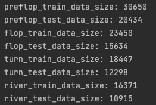
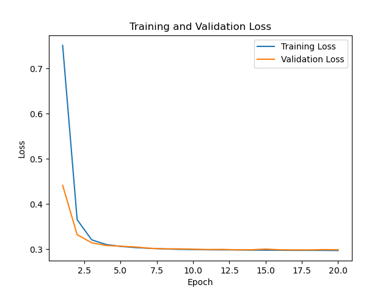
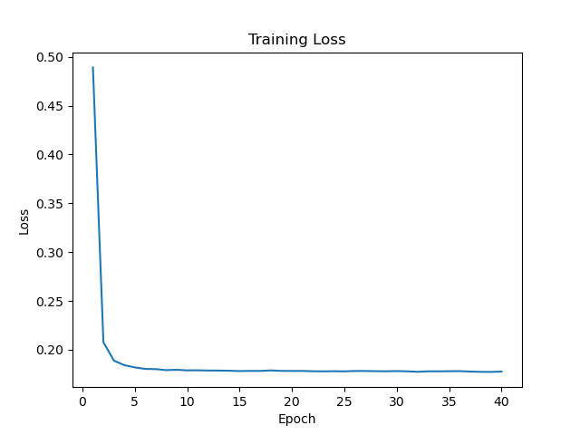

# Create datasets with datapickler.py

Just run it to get a pickel that you can call for training
This is what it does:
1. Loads raw log files
2. Random shuffles them
3. Parses the raw files like so:

- Last possible action to final action
tuple(pf, f, t, r)
preflop: List[Matrix, Integer: Supervised Target]
flop: List[Matrix, Integer: Supervised Target]
turn: List[Matrix, Integer: Supervised Target]
river: List[Matrix, Integer: Supervised Target]

- Every possible action to subsequent action; not across round boundaries
preflop: List[Matrix, Integer: Supervised Target]
flop: List[Matrix, Integer: Supervised Target]
turn: List[Matrix, Integer: Supervised Target]
river: List[Matrix, Integer: Supervised Target]
  
4. Creates pickles for each type of dataset

# Prepare data for training and testing + training and testing in run_training.py
1. Prepares the data from the pickles for training.  You can switch the pickle file depending on which dataset you want to work with.

   
   
   
   
2. You can run training and testing models for each street. Training will produce a learning curve and save the model. Test prints the accuracy of the model.
(For the best model hyperparameters according to the authors)

   
   
  <i>Learning curve for preflop with last possible action. Accuracy: 80.18%</i>
   
   

   
   
  <i>Learning curve for flop with last possible action. Accuracy: 81.97%</i>
   
   

   
   
  <i>Learning curve for turn with last possible action. Accuracy: 90.21%</i>
   
   

   
   
  <i>Learning curve for river with last possible action. Accuracy: 87.96%</i>
   
   

## TODO: visualizations with tuning hyperparameters
## TODO: WRITE THE REPORT