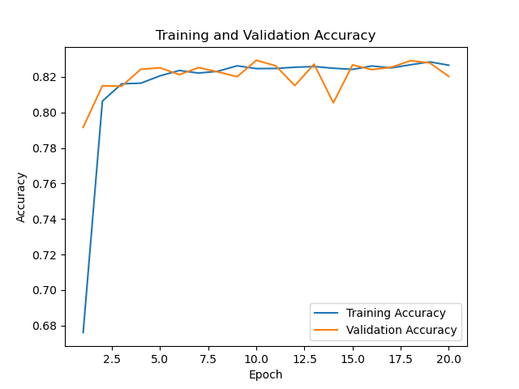
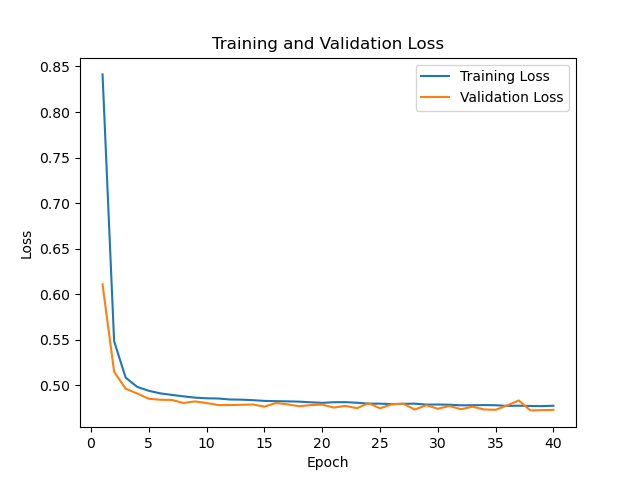

# Create datasets with datapickler.py

Just run it to get a pickel that you can call for training
This is what it does:
1. Loads raw log files
2. Random shuffles them
3. Parses the raw files like so:

- Last possible action to final action
tuple(pf, f, t, r)
preflop: List[Matrix, Integer: Supervised Target]
flop: List[Matrix, Integer: Supervised Target]
turn: List[Matrix, Integer: Supervised Target]
river: List[Matrix, Integer: Supervised Target]

- Every possible action to subsequent action; not across round boundaries
preflop: List[Matrix, Integer: Supervised Target]
flop: List[Matrix, Integer: Supervised Target]
turn: List[Matrix, Integer: Supervised Target]
river: List[Matrix, Integer: Supervised Target]
  
4. Creates pickles for each type of dataset

# Prepare data for training and testing + training and testing in run_training.py
1. Prepares the data from the pickles for training.  You can switch the pickle file depending on which dataset you want to work with.
60% training, 20% validation, 20% testing
   
| Last possible action datasets | Last action datasets|
| :-------- | :-------- |
|  |  |

2. You can run training and testing models for each street. 

  * Training will produce a learning curve and save the model. 
  * Test prints the accuracy of the model.

The following learning curves are for the best model hyperparameters according to the authors except for pre-flops (they didn't include pre-flop results in the paper)

### Last possible action datasets

| Pre-flop Accuracy: 79.31% | Flop Accuracy: 83.21%|
| :--------: | :--------: |
|  |  |
| **Turn Accuracy: 90.57%**| **River Accuracy: 87.41%**|
|  |  |

# Supplementary material

### Last action datasets

| Pre-flop Accuracy: 69.52% | Flop Accuracy: 65.55%|
| :--------: | :--------: |
|  |  |
| **Turn Accuracy: 79.91%**| **River Accuracy: 75.87%**|
|  |  |

