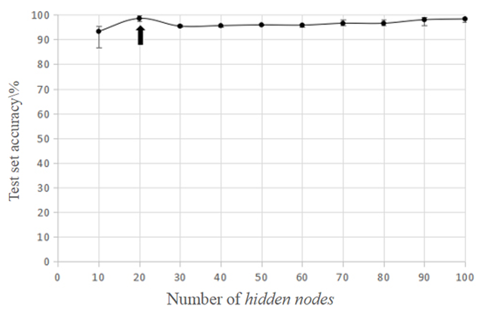

# Visualization

Currently, the generate_charts.py contains two method to generate plots similar to the one's in "Auto-encoder neural network based prediction of Texas poker opponent's behavior":

hidden_nodes_plot(data, arrow_x, filepath=None, line=2)

and

epoch_plot(data, arrow_x, filepath=None, line=2)

Where data is formated as a dictionary where the keys (for instance, number of hidden nodes) will be X and the accuracy values will determine Y. 
Based on the graphs from the paper, is looked like they were using average and hi/low bars. 
I am not clear on what the line is representing. Did they ran all values between the plotted ones, or are they interpelating the values for visual clarity?
For now, I made it as an option to add a line that interpolates between the data. The line paramter, when set to None, draws no line. Higher values smooth out the interpolation (1 is linear).

   
   
  <i>hidden nodes accuracy</i>
   
   

   
   
  <i>from paper: hidden nodes accuracy</i>
   
   

   
   
  <i>epoch accuracy</i>
   
   

   
   
  <i>from paper: epoch accuracy</i>
   
   

